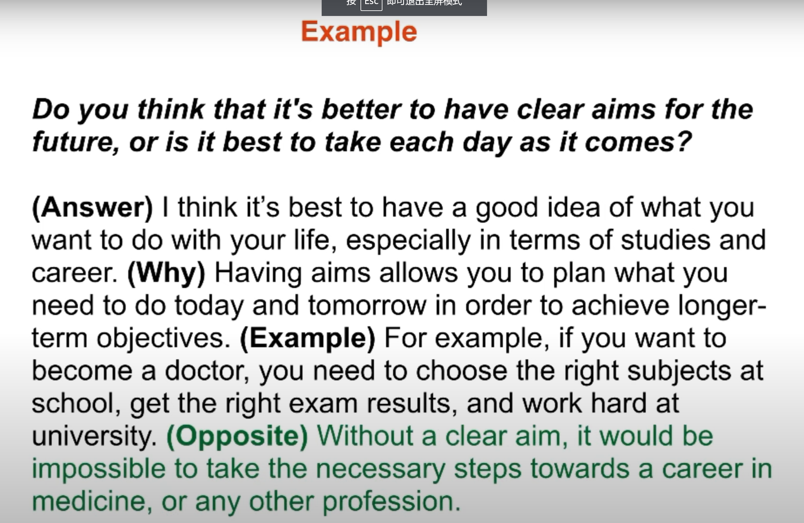

## Speaking Part3

### Advice ： structure，4-steps

==answer + explain + example + alternative==

### Possible Question：

#### 1.languages

1.1 **When do students in China start to learn foreign languages? **

Answer： In China, students typically start learning foreign languages, such as English, in primary school.

Explain: ==This early introduction to foreign languages is part of the **national curriculum**, aiming to **equip students with essential language skills and foster a global perspective**==. Learning a foreign language from a young age not only **enhances communication abilities but also opens doors to international opportunities in the future**.

Example: For instance, my younger cousin began learning English in the first grade. The curriculum included basic vocabulary, simple conversations, and cultural aspects. **This early exposure** helped her develop a solid foundation in English.

1.2 **What qualities should a language teacher have? **

Answer: A language teacher should **possess qualities** such as **effective communication skills, cultural awareness, and adaptability.**

Explain: Effective communication skills **are crucial for** a language teacher to **convey complex language concepts and facilitate understanding**. Cultural awareness is important to **provide context and nuances in language usage, promoting a holistic understanding of the language**. Adaptability is essential for **tailoring teaching methods to meet the diverse needs of students and addressing their individual learning styles**.

Example: For instance, a language teacher who is proficient in English and understands its cultural subtleties can effectively teach English to non-native speakers. If a teacher is adaptable, they can **modify their teaching strategies based on the students' proficiency levels and learning preferences**. 

#### 2.Art

Today’s youth predominantly harness digital platforms to share art. Social media, like Instagram, showcases their creations, while YouTube hosts tutorial videos. Additionally, online forums provide critique and collaboration. Thus, merging technology with passion, young artists not only display but also engage, fostering a vibrant, global artistic community.

#### 3.Technology

Nowadays, people rely on various electronic gadgets like smartwatches, mobile phones, and 3D cameras to enhance their standard of living. Additionally, household appliances such as vacuum cleaners, blenders, and food processors have simplified chores and saved time.
