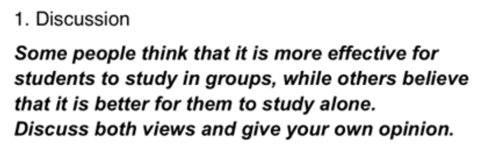
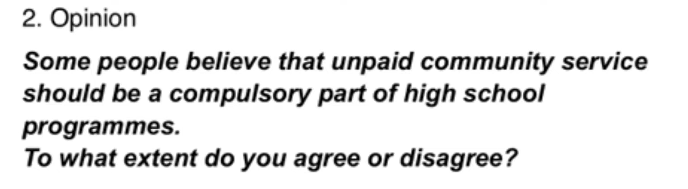
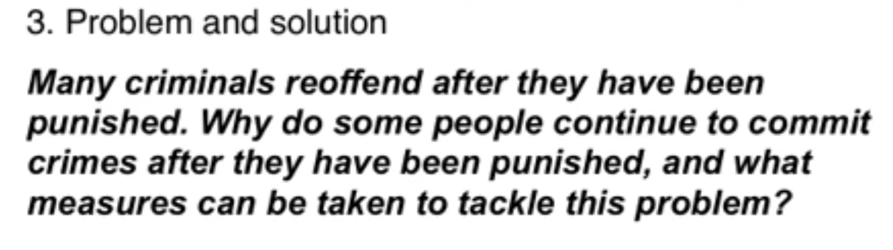
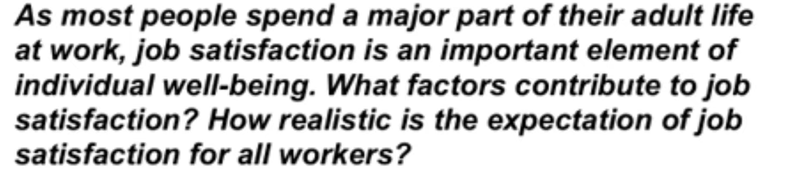
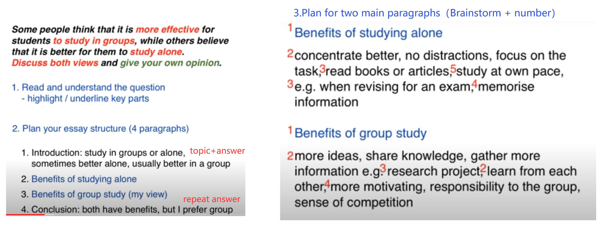

## Writing Task2

### 0.General Proposal: 

==4 paragraphs(13 senteces) in 40 min==

Planning                                          10min

Introduction(2 sentences)            5min

Two main paragraphs(5/each)    10min*2

Conclusion(1)                                  5min

### 1.Indroction （2）: paraphrase topic+ answer

1. #### **Discussion **

   

   **People have different views about** the effectiveness of group study **as opposed to** working alone. While there are some benefits to studying independently, I believe that group work is usually more __productive__. 

   

2. #### **Opinion **

   

   **It is sometimes argued that **high school students should be made to do some work in their local communities. I completely agree that this kind of __scheme__ would be a good idea. // In my opinion, it would be wrong to __force__ teenagers to do any kind of  __unsalaried__ work. // ==While I disagree with the idea of making such programmes compulsory,  I do believe that __voluntary__ community service could benefit young people.==

   

3. #### **Problem and solution**

    

    It is true that punishments do not always **deter** criminals from committing more crimes.  There are various reasons why offenders repeatedly break the law, but governments could certainly take steps to address this issue. 

   

4. #### **Two-part question**

    
    
    Work plays a central role in our lives, and we would all like to feel fulfilled professionally.  While a variety of factors may lead to job satisfaction, it would be unrealistic to expect  everyone to be happy at work.

### 2.Main Paragraphs（5*2）

Two structure: 

- Firstly,Secondly,Finally (One reason is that...，Furthermore) ：Multiple reasons

- Idea,Explain,Example ：Only one reason

Notes ：Pay attention to the topic vocabulary

​	==There are several reasons why== I would argue against having compulsory community service for secondary school students. ==Firstly,== the school **curriculum** is already full with important **academic **subjects, such as maths, science and languages. ==For example,== I  remember having an extremely busy **timetable** when I was at high school, and it would not  have been possible to add to it. ==Secondly,== students’ **performance** in other subjects would  be affected if valuable study time were taken by **charity work or neighborhood  improvement schemes.** ==Finally,== I believe that teenage students would be **reluctant** to take  part in any programme of **obligatory** work, and this could lead to poor **motivation** and even  bad behaviour. 

​	==On the other hand,== the **opportunity** to do voluntary community service could be extremely  positive for high school students. By making these programmes **optional**, schools would  ensure that only motivated students took part. These young people would **gain** valuable  experience in an adult working **environment**, which could help to build their self confidence  and **enhance** their skills. Having such experience and skills on their CVs could greatly  improve school leavers’ career **prospects**. ==For example,== a period of voluntary work  experience might impress a university **admissions** officer or a future employer.

### 3.Conclusion(1) : paraphrase your answer

1. #### Discussion 

   question： In many cities the use of video __cameras__ in public places is being increased in order to  reduce crime, but some people believe that these measures restrict our individual  freedom. Do the benefits of increased security outweigh the drawbacks? 

   

   Introduction ：

   It is true that video __surveillance__ has become **commonplace** in many cities in recent years. While  I understand that critics may see this as **an invasion of privacy**, I believe that there are  more benefits than drawbacks. 

   Conclusion ：

   ==In conclusion,== I would argue that the advantages of using video **security system** in public  places do ==outweigh the disadvantages.==

   

2. #### Opinion 

   question： Families who send their children to private schools should not be required to pay taxes that support the state education system. To what extent do you agree or disagree with this statement? 

   

   Introduction：

    Some people believe that parents of children who attend private schools should not need to **contribute to state schools through taxes**. Personally, I completely disagree with this  view. 

   Conclusion：

   In conclusion, I do not believe that any **financial concessions** should be made for people who  choose private education. 

   

3. #### Problem and solution 

   question ：In the developed world, average life expectancy is increasing. What problems will this cause for individuals and society? Suggest some measures  that could be taken to __reduce__ the impact of ageing populations. 

   

   Introduction ：

   It is true that people in industrialised nations can expect to live longer than ever before.  ==Although there will undoubtedly be some negative consequences of this trend, societies can take steps to __mitigate__ these potential problems.== 

   Conclusion：
    In conclusion, various measures can be taken to __tackle__ the problems that are certain to  arise as the populations of countries grow older. 

   

4. #### Two-part 

   question ：There are many different types of music in the world today. Why do we need music? Is the traditional music of a country more important than  the international music that is heard everywhere nowadays? 

   

   Introduction：

    It is true that a rich variety of musical styles can be found around the world. Music is a  vital part of all human cultures for a range of reasons, and I would argue that traditional  music is more important than modern, international music. 

   Conclusion ：

   In conclusion, music is a necessary part of human existence , and I believe that traditional music  should be given more importance than international music.

### 4.	Planning : Answer,Structure,Ideas

3-steps: 

- Answer
- Structure
- Ideas
  - brainstorm, details & examples & Why
  - group related ideas by numbering them

***Many high street shops have gone out of business in recent years. Why do you think this has happened? Is it a positive or negative development?***

**1. My answer**

Online shopping is the main reason. The trend is both positive and negative.

**2. Structure: four paragraphs**

\- Introduce the topic, and give a brief answer to both questions
\- Main paragraph about online shopping
\- Main paragraph about the positive and negative impacts
\- Conclude by summarising the overall answer

**3. Ideas for the main paragraphs**

- Online shopping is faster, cheaper and more convenient. People can sit at home, search for the best deal, pay, and receive a delivery the next day. Impossible for stores to compete. Personal example: recent purchases on Amazon.
- Positives: a world of choice, a solution for busy people or those who can't leave the house. Negatives: rising unemployment, loss of community as high streets become deserted.

**Full paragraph for main paragraph 1:**

In my opinion, high street shops are disappearing due to competition from online shopping websites, which are cheaper and more convenient. Web-based stores allow customers to search for the best deals, make purchases from the comfort of their homes, and receive delivery of their purchased items the next day. Furthermore, it is impossible for traditional bricks-and-mortar stores to compete with the range of choice that can be found online. For example, I recently used the website Amazon to buy some fairly rare academic textbooks that were not stocked at my local bookshop. As a customer, the fact that I can find any product imaginable online makes it almost pointless for me to make a trip to my local high street.

