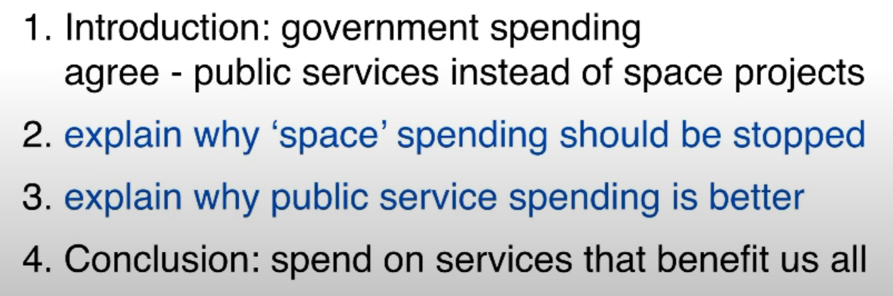
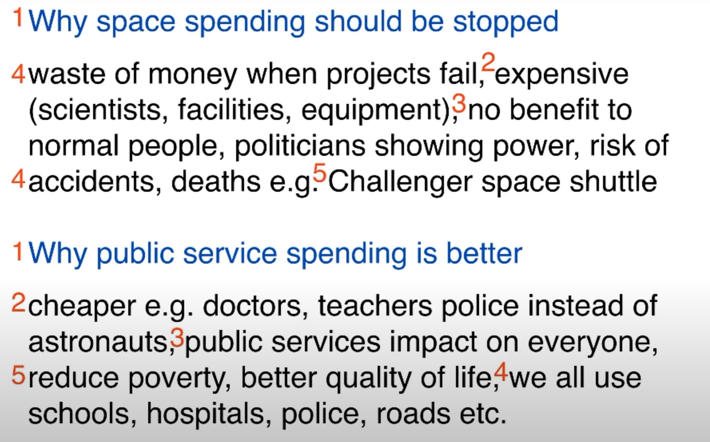
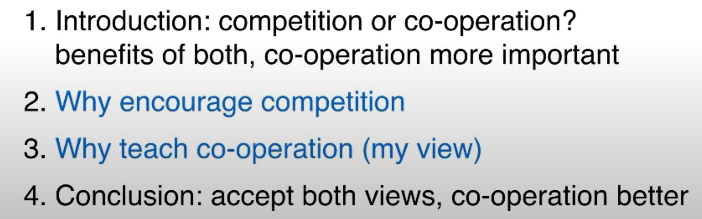
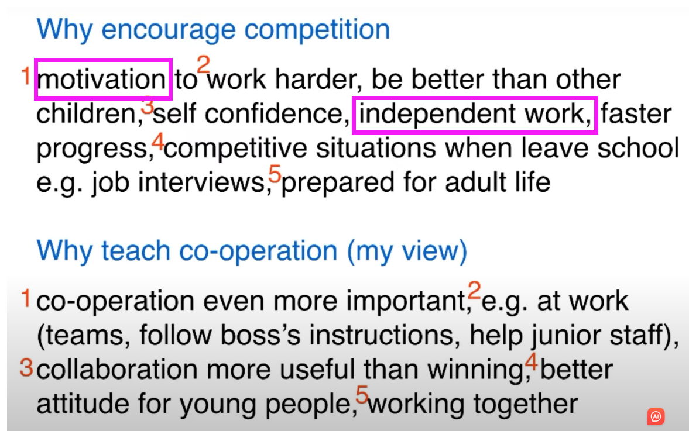
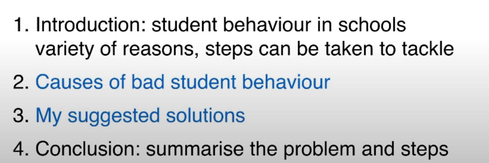
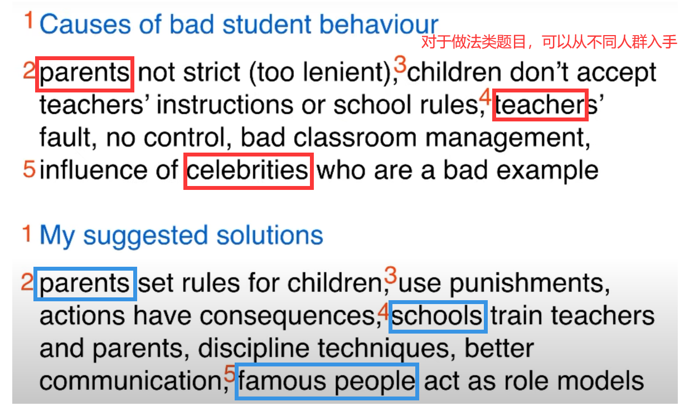
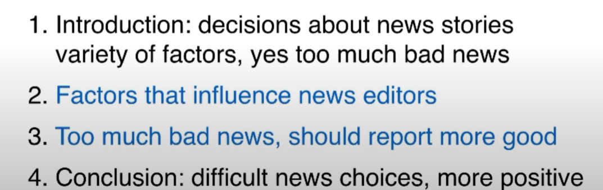
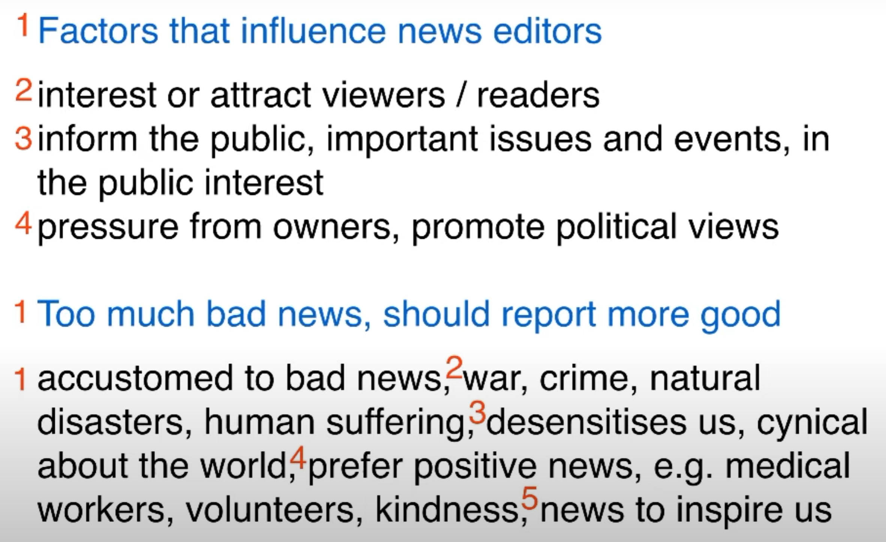

范文食用说明：

1. 第一次看题目，先脑暴，structure & idea

2. 看范文，注意勾画 **topic vocabulary, linking structure**；补充脑暴

3. 对照脑暴，复写并修改

4. 第二天复习时，着重积累 **勾画内容** 并关注行文结构

   

### Opinion：

##### 1.The money spent by governments on space programmes would be better spent on  vital public services such as schools and hospitals. To what extent do you agree or disagree? 

Structure:

Ideas:

Governments in some countries **spend large amounts of money on** space exploration programmes. I completely agree with the idea that these are a waste of money, and that the funds should **be allocated to(金钱分配)** public services. 

==There are several reasons why space programmes **should be abandoned(应该被叫停).**== ==Firstly,== it is extremely expensive to train scientists and other staff **involved with space missions**, and  **facilities and equipment** also **come at a huge cost (cost a fortune)** to the government. ==Secondly,== these  programmes do not benefit normal people in our daily lives; they are **simply vanity projects  for politicians(政客虚荣的手段）**. ==Finally,== many missions to space fail completely, and the smallest technological error can **cost astronauts their lives(付出生命代价). **The **Challenger space shuttle disaster(挑战者的悲剧)**showed us that **space travel is extremely dangerous**, and in my opinion **it is not worth the risk. (不值得去冒险）**

**==I believe that the money from space programmes should go to vital public services instead.==**  It is much cheaper to train doctors, teachers, police and other **public service workers(基层工作人员)** than  it is to train astronauts or the scientists and engineers who work on space exploration projects. ==Furthermore,== **public servants** do jobs that have a positive impact on **every  member of society**. ==For example,== we all use schools, hospitals and roads, and we all need **the security that the police provide(注意：the police是复数).**==If governments **reallocated the money**==(注意：虚拟语气从句用过去式) spent on space travel and research, many thousands of people **could be lifted out of poverty(消除贫困)** or given **a better quality of life(生活质量提高，注意加冠词a）**.

==In conclusion, my view is that== governments should spend money on services that benefit **all members of society**, and it is wrong to **waste resources on** projects that do not **improve our everyday lives**. (275 words, band 9)

虚拟语气

|      | If 从句               | 主句                          |
| ---- | --------------------- | ----------------------------- |
| 现在 | did/were              | would/could/might + do        |
| 过去 | had done/been         | would/could/might + have done |
| 将来 | should do/ were to do | would/could/might + do        |

#### Discussion：

##### 1.Some people think that a sense of competition in children should be encouraged.  Others believe that children who are taught to co-operate rather than compete  become more useful adults. Discuss both these views and give your own opinion.  

Structure：

Ideas：

注意在考虑competition不应该只考虑成绩方面的竞争；还有通过Games或prizes来激励学习的方式。

People have different views about whether children should be taught to be competitive or co-operative. While a spirit of competition can sometimes be useful in life, I believe that the ability to co-operate is more important. 

==On the one hand, competition can be a great source of motivation for children.== When  teachers use games or prizes to introduce an element of competitiveness into lessons, it  can encourage children to **work harder to outdo the other pupils** in the class. This kind of  **healthy rivalry** may help to build children’s self confidence, while **pushing them to work independently and progress more quickly**. When these children leave school, their confidence and determination will help them **in competitive situations such as job  interviews**. **It can therefore be argued that** competition should be encouraged in order to  prepare children for adult life.

==On the other hand, it is perhaps even more important to **prepare children for the many aspects of adult life that require co-operation**.== In the workplace, adults are expected to **work in teams, follow instructions given by their superiors, or supervise and support the  more junior members of staff**. Team collaboration skills are much more useful than **a  competitive determination to win**. This is the attitude that I believe schools should foster in  young people. Instead of **promoting the idea that people are either winners or losers**,  teachers could show children that they gain more from working together.  

==In conclusion, I can understand== why people might want to encourage competitiveness in  children, ==but it seems to me== that a co-operative attitude is much more desirable in adult life.

### Problems & Solutions

##### 1.In many countries schools have severe problems with student behaviour. What do you think are the causes of this? What solutions can you suggest?

Structure：

Ideas:

==It is true that== the behaviour of school pupils in some parts of the world has been getting worse in recent years. ==**There are a variety of possible reasons for this, but steps can definitely be taken to tackle the problem.**==

==In my opinion, **three main factors are to blame for**== the way young people behave at school nowadays. Firstly, modern parents tend to be too **lenient or permissive(太纵容了). **Many children **become accustomed to getting whatever they want**, and they find it difficult to accept the **demands of teachers or the limits imposed on them by school rules**. Secondly, if teachers cannot control their students, there must be an issue with the **quality of classroom management training(课堂管理质量) or support within schools.** Finally, children are influenced by the behaviour of celebrities, many of whom set the example that success can be achieved without finishing school.

==Student behaviour can certainly be improved.== I believe that the **change must ==start with== parents**, who need to be persuaded that it is important to set firm rules for their children. When children **misbehave or break the rules**, parents should use **reasonable punishments to demonstrate that actions have consequences(告诫他们行为要付出代价).** ==Also,== schools could play an important role in training both teachers and parents to **use effective disciplinary techniques**, and in **improving the communication between both groups(促进双边交流)**.==At the same time,== famous people, such as musicians and football players, need to understand the responsibility that they have to act as role models to children. 

==In conclusion,== **schools will continue to face discipline problems unless** parents, teachers and **public figures(公众人物)** set clear rules and **demonstrate the right behaviour themselves**.

### Two-part questions

##### 1.News editors decide what to broadcast on television and what to print in newspapers. What factors do you think influence these decisions? Do we become used to bad news, and would it be better if more good news was reported?

Structure:

Ideas:

It is true that editors have to **make difficult decisions** about which news stories they broadcast or publish, and their **choices are no doubt influenced by a variety of factors**. In my opinion, we **are exposed to** too much bad news, and **==I would welcome a greater emphasis on==** good news.  

==Editors **face a range of considerations when deciding what news stories to focus on**.==  Firstly, **I imagine that** they have to consider ==whether viewers or readers will be **interested  enough to choose their television channel or their newspaper over competing providers**.==  Secondly, news editors have **a responsibility to inform the public** about important events  and issues, and ==they should therefore **prioritise stories that are in the public interest.**==  Finally, editors are probably **under some pressure from the owners** who employ them. For  example, a newspaper owner might have **particular political views** that he or she wants to  promote.  

It seems to me that people do **become accustomed to** negative news. ==We **are exposed on a daily basis to stories** about== war, crime, natural disasters and tragic human suffering  around the world. ==I believe that such **repeated exposure gradually desensitises people**,  and we become more **cynical about the world and more sceptical**== that we can do anything  to change it. **I would prefer** to see more positive news stories, such as **reports of the work of medical staff after a natural disaster, or the kindness of volunteers who help in their communities**. This kind of news might **inspire us all to lead better lives**.  

In conclusion, **it must be extremely difficult for editors to choose which news stories to present**, but I would like to see a more positive approach to this vital public service. (285 words, band 9) 

